# Manual del Usuario

## Usuario sin registro  
  
### Página de inicio  
Lo primero que verás es la página de inicio, donde se encuentra una descripción de la cooperativa.  
  

### Productos  
  
Puedes realizar diferentes acciones:  

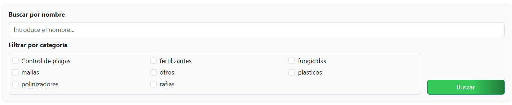  

- **Buscar por nombre**: buscará cualquier coincidencia de letras con el producto. No es necesario escribir el nombre completo.
- **Filtrar por categoría**: elige una o varias categorías para que se muestren los productos que pertenezcan, como mínimo, a una de ellas.
- **Combinación**: puedes combinar búsqueda por nombre con la categoría que desees.

Si no se selecciona ningún filtro de búsqueda, se mostrarán todos los productos. Al hacer clic en **"añadir al carro"**, el producto se añadirá automáticamente al carrito. Si hay varias páginas de productos, se podrán consultar gracias a la **paginación** que aparece abajo.

### Contacto  
  
Esta sección está dividida en dos partes:  

  
- **Datos de contacto**:
  - Teléfono de la cooperativa
  - Dirección de la cooperativa
  - Correo electrónico de la cooperativa  
  
- **Formulario de contacto**:
  - Puedes dejar un mensaje proporcionando tu nombre y correo electrónico.

### Carrito  
  
En esta sección podrás consultar los productos añadidos al carrito de la compra.  
Para formalizar el pedido, haz clic en **"procesar pedido"**.  
> **Nota:** No podrás realizar ningún pedido si no te has registrado previamente en la web.  
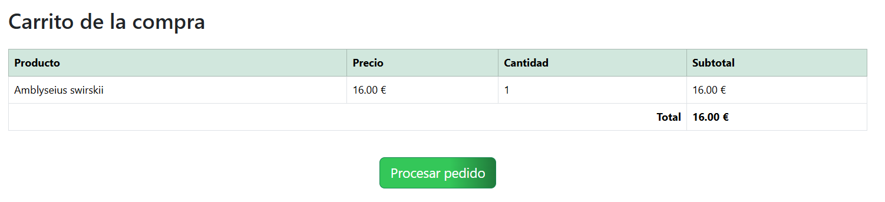  
## Registrarse e Inicio de sesión  

En la barra de navegación encontrarás dos botones: **Registrarse** y **Iniciar sesión**.  
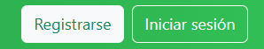

### Registrarse

Al hacer clic en el botón, aparecerá una **ventana modal** con un formulario.  
Debes rellenar los datos solicitados.  
Para continuar con el registro, deberás volver a hacer clic en el botón **"registrarse"** de la ventana modal.  
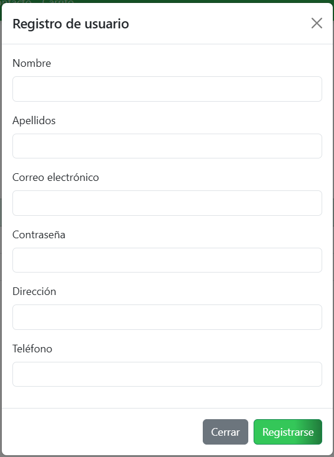  

### Inicio de sesión

Si ya estás registrado, solo tienes que hacer clic en el botón **"iniciar sesión"**.  
Se abrirá una ventana modal donde se te pedirá el **correo electrónico** y la **contraseña**.  
Después, haz clic en el botón **"iniciar sesión"**.  
  

### Cerrar sesión

Para cerrar sesión, simplemente haz clic en el botón **"cerrar sesión"**.  
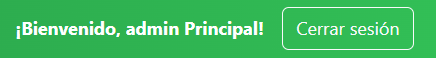

---

## Usuario Administrador  
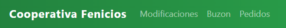  

Si eres administrador, tendrás acceso a opciones adicionales:

- **Modificaciones**
- **Buzón**
- **Pedidos**

### Modificaciones

Al hacer clic en el desplegable **"elige una opción"**, se mostrarán las siguientes funciones:  
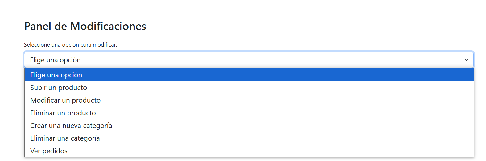  

#### Subir un producto  
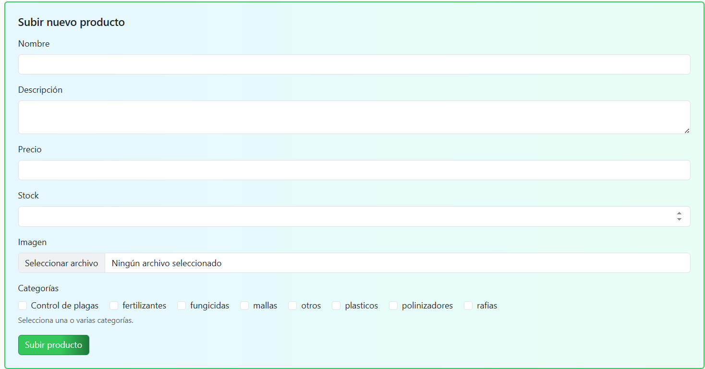  

Se mostrará un formulario con campos para rellenar.  
Después de completarlo, haz clic en **"subir producto"** para añadirlo al catálogo.

#### Modificar productos  
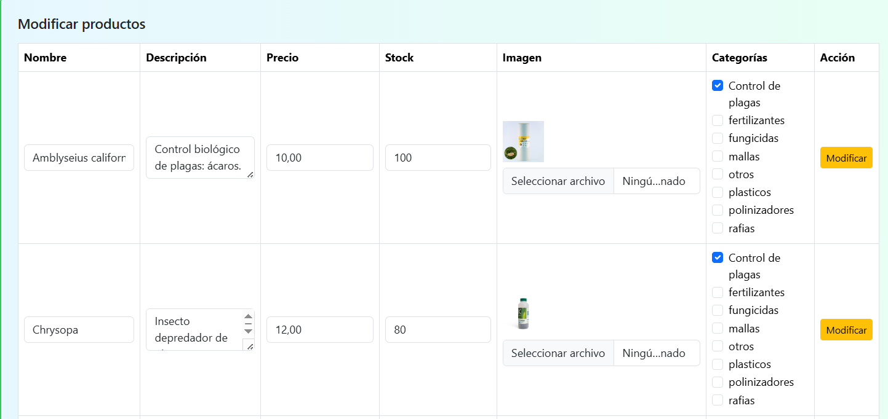  
Aparecerá una tabla con todos los productos y su información.  
Puedes editar directamente lo que desees y luego hacer clic en **"modificar"**.

#### Eliminar producto  
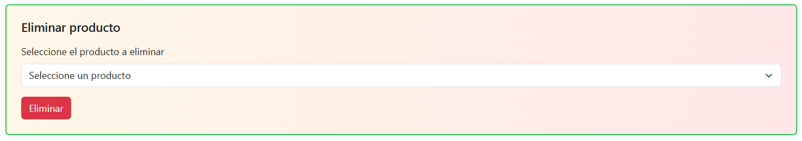  

Se mostrarán los nombres de los productos.  
Selecciona el que quieras eliminar y haz clic en **"eliminar"**.

#### Crear una nueva categoría  
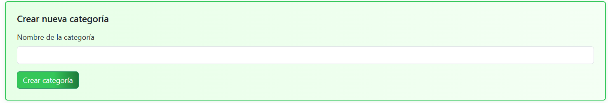  

Escribe el nombre de la categoría y haz clic en **"crear categoría"**.

#### Eliminar categoría  
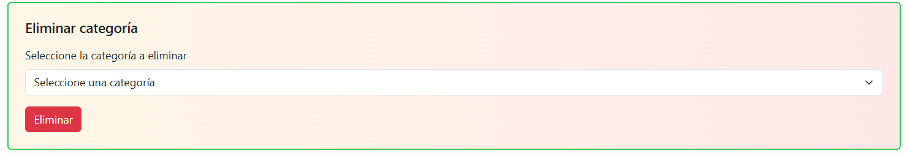  

Se desplegarán todas las categorías existentes.  
Selecciona la que quieras borrar y haz clic en **"eliminar"**.

### Pedidos realizados  
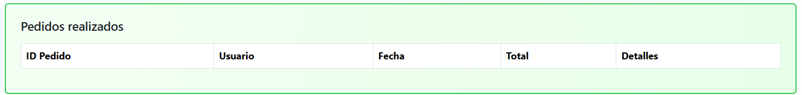  

Puedes consultar todos los pedidos.  
Si haces clic en **"detalles"**, podrás ver los productos incluidos en cada compra.

### Buzón
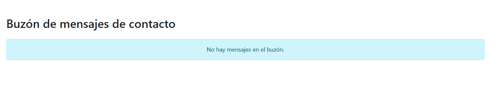  

Se muestran los mensajes que han sido recibidos a través del formulario de contacto.

### Pedidos
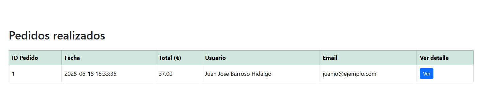  

Se muestra en detalle el historial de pedidos realizados por los usuarios.