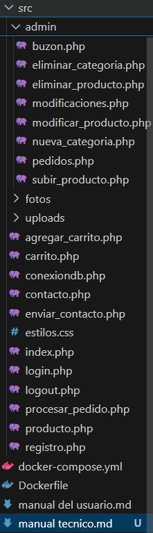
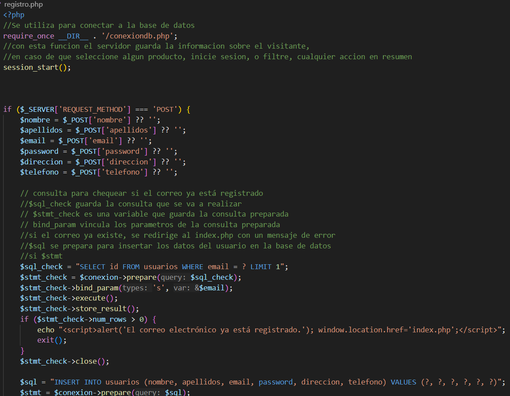
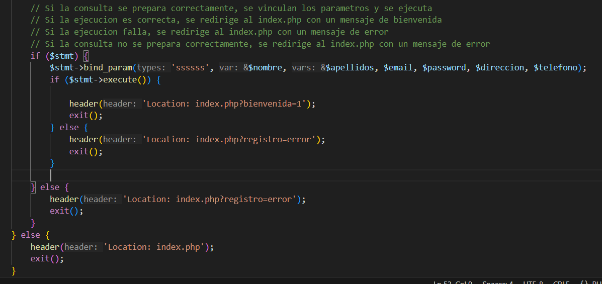

# Manual Técnico - Cooperativa Fenicia

## Descripción General

Este repositorio implementa una plataforma web para la gestión y ventas de productos fitosanitarios en la Cooperativa Agrícola Fenicios. Está desarrollado principalmente en **PHP** (backend y lógica), **CSS** (personalización visual) y utiliza **Bootstrap** para el diseño responsivo. Permite a usuarios registrados realizar compras, y a administradores gestionar productos, categorías, pedidos y la comunicación con usuarios.

---

## Arquitectura General

- **Lenguajes:** PHP, HTML, CSS, MySQL, JavaScript
- **Estructura principal:**
  - `src/` contiene la aplicación PHP principal
  - `src/admin/` contiene el panel de administración
  - `src/estilos.css` contiene los estilos personalizados
  - documentación en `manual del usuario.md` `manual tecnico.md`

---

## Estructura de Carpetas y Archivos Clave    
    

## Componentes y Funcionalidades

### 1. Página de Inicio (`src/index.php`)
- Presenta la cooperativa
- Menú de navegación con enlaces a las distintas secciones.
- Incluye autenticación de sesión para mostrar opciones según estado del usuario.

### 2. Registro e Inicio de Sesión (`src/registro.php`)
- Formulario modal para crear nuevos usuarios.
- Validación de datos y comprobación de existencia previa de email.
- El usuario registrado puede iniciar sesión y acceder a la compra. 

   

### 3. Catálogo y Carrito de Compras (`src/carrito.php`)
- Visualización de productos, filtrado por nombre/categoría y paginación.
- Añadir productos al carrito, visualización y modificación del mismo.
- Solo usuarios autenticados pueden procesar pedidos.

### 4. Procesamiento de Pedido (`src/procesar_pedido.php`)
- Verifica autenticación y existencia de productos en carrito.
- Extrae el usuario de la sesión y guarda el pedido en la base de datos.
- Muestra confirmación de pedido exitoso.

### 5. Panel de Administración (`src/admin/`)
- Solo accesible para el usuario `admin@ejemplo.com`.
- **modificaciones.php**: Añadir, editar, eliminar productos y crear categorías.
- **buzon.php**: Visualiza mensajes enviados mediante el formulario de contacto.
- **pedidos.php**: Consulta lista de pedidos realizados por usuarios, con detalles.

---

## Gestión de Sesiones y Seguridad

- Se utiliza `session_start()` en cada archivo PHP para gestionar la sesión.
- El acceso a páginas de administración está restringido comprobando el email de sesión.
- Los formularios de registro y login emplean validación básica y comprobación de duplicidad de usuario.
- Redirecciones automáticas si no se cumplen los requisitos de autenticación.

---

## Estilos y Responsividad

- Personalización de la interfaz en `src/estilos.css`:
  - Diseño responsivo para dispositivos móviles.
  - Paleta de colores y estilos para la marca de la cooperativa.
  - Accesibilidad y contraste mejorados en enlaces y botones.
- Uso de Bootstrap para componentes y grillas responsivas.

---

## Imágenes y Documentación de Usuario

- El archivo `manual del usuario.md` y la carpeta `md/` contienen capturas y manual detallado de uso para usuarios y administradores.
- Las imágenes ilustran el flujo de navegación, compra, gestión y uso del panel de administración.

---

## Ejemplo de Flujo Técnico

1. Usuario accede a la web, navega por productos y filtra según nombre/categoría.
2. Si desea comprar, debe registrarse e iniciar sesión.
3. Añade productos al carrito, revisa y procesa el pedido.
4. El pedido se guarda en la base de datos y el usuario recibe confirmación.
5. El administrador puede gestionar productos, categorías, revisar pedidos y mensajes desde el panel de administración.

---

## Dependencias

- PHP 7.x o superior
- Servidor web Apache/Nginx con soporte PHP
- MySQL (para la base de datos)
- Bootstrap 5 (CDN)

---

## Notas de Desarrollo

- El código está comentado en los principales scripts PHP para facilitar el mantenimiento.
- Las rutas relativas y el uso de sesiones facilitan la portabilidad del sistema.
- El sistema está pensado para ser ampliado en funcionalidades administrativas o de usuario final.

---

## Recursos adicionales

- Manual de usuario funcional: `manual del usuario.md`
- Carpeta `md/` con imágenes y ejemplos de pantallas.

---

**Autor:** kuakoze 